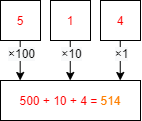
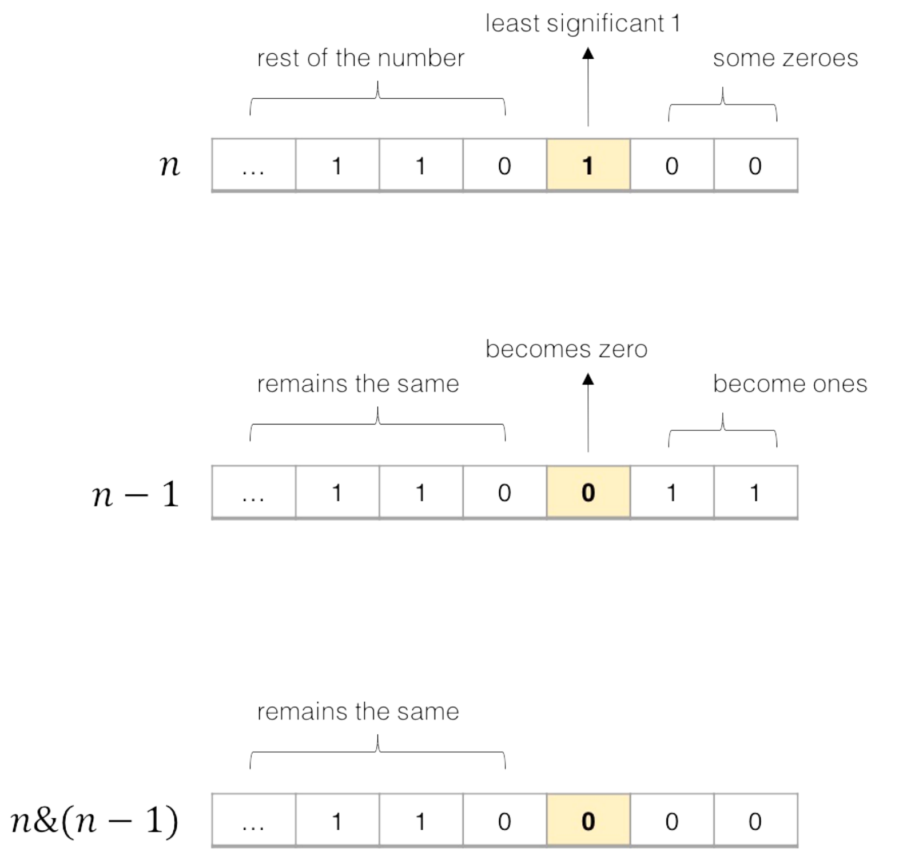

### 位运算
二进制数“1101 0110”所对应的数值是“214”。

二进制
十进制
#### 特性
1. 如果一个二进制数（整型）数的第零位的值是1，那么这个数就是奇数；而如果该位是0，那么这个数就是偶数。
2. 如果一个二进制数的低端n位都是零，那么这个数可以被2n整除。
3. >**如果一个二进制数的第n位是一，而其他各位都是零，那么这个数等于2^n。**
4. 如果一个二进制数的第零位到第n - 1位都是1，而且其他各位都是0，那么这个数等于2^n - 1。
5. >将一个二进制数的所有位左移移位的结果是将该数乘以二。
6. >将一个无符号二进制数的所有位右移一位的结果等效于该数除以二（这对有符号数不适用）。余数会被下舍入（rounddown)
7. 将两个n位的二进制数相乘可能会需要2*n位来保存结果。
8. 将两个n位的二进制数相加或者相减绝不会需要多于n 1位来保存结果。
9. >将一个二进制数的所有位取反（就是将所有的一改为零，所有的零改为一）等效于将该数取负（改变符号）再将结果减一。
10. 将任意给定个数的位表示的最大无符号二进制数加一的结果永远是零。
11. 零递减（减一）的结果永远是某个给定个数的位表示的最大无符号二进制数。
12. n位可以表示2n个不同的组合。
13. 十进制数2^n-1，对应二进制所有n位都是一。
#### 算法解释
常用技巧

位运算是算法题里比较特殊的一种类型，它们利用二进制位运算的特性进行一些奇妙的优化 和计算。
常用的位运算符号包括：“∧”按位异或、“&”按位与、“|”按位或、“∼”取反、“<<” 算术左移和“>>”算术右移。
以下是一些常见的位运算特性，其中 0s 和 1s 分别表示只由 0 或 1 构成的二进制数字。
```
x ^ 0s = x    x ^ 1s = ~x    x ^ x = 0

x & 0s = 0    x & 1s = x     x & x = x

x | 0s = x    x | 1s = 1s    x | x = x
```
## 算法常⽤操作 n&(n-1)
`n & (n - 1)` 作⽤是消除数字 n 的⼆进制表⽰中的最后⼀个1。


例如对于二进制表示 11110100 ，减去 1 得到 11110011，
这两个数按位与得到 11110000。n & (-n) 可以得到 n 的位级表示中最低的那一位，
例如对于二进制表示 11110100，取负得到 00001100，这两个数按位与得到 00000100。 
还有更多的并不常用的技巧，若读者感兴趣可以自行研究，这里不再赘述。

练习TODO：

基础难度

268. Missing Number (Easy)

Single Number 的变种题。除了利用二进制，也可以使用高斯求和公式。

693. Binary Number with Alternating Bits (Easy)

利用位运算判断一个数的二进制是否会出现连续的 0 和 1。

476. Number Complement (Easy)

二进制翻转的变种题。

进阶难度

260. Single Number III (Medium)

Single Number 的 follow-up，需要认真思考如何运用位运算求解。

####
快速幂参考：
1. [python整数快速幂和矩阵快速幂](https://blog.csdn.net/bianxia123456/article/details/105167294/)
2. [leetcode 50. Pow(x, n)官方题解](https://leetcode-cn.com/problems/powx-n/solution/powx-n-by-leetcode-solution/)