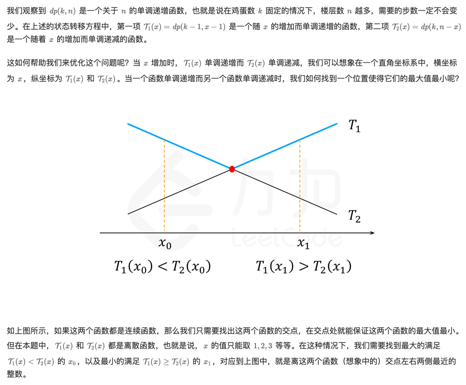

leetcode: 
- [1884.鸡蛋掉落-两枚鸡蛋](https://leetcode.cn/problems/egg-drop-with-2-eggs-and-n-floors/description/)
- [887.鸡蛋掉落](https://leetcode.cn/problems/super-egg-drop/description/)

讲解
- [李永乐老师讲解 双蛋问题](https://www.bilibili.com/video/BV1KE41137PK/?vd_source=2d85a78c3848c763883965c81d61a804)
- [李永乐老师讲解评论区c++代码](https://www.acwing.com/blog/content/615/)
需要在min(max())计算的时候再叠加二分法，否则暴力求解会超时

```c++
#include<iostream>
#include<algorithm>
#include<cstring>
#include<cstdio>

using namespace std;

const int N = 1010, INF = 1e9;

int n, m;
int f[N][N];        //  f[i][j]表示共i层楼j个鸡蛋时最少要试几次保证能找到临界点

int main()
{
    scanf("%d%d", &n, &m);

    for(int i = 1; i <= n; i ++)
    {
        //  楼层数为i时，鸡蛋数量为1时，需要从低到高遍历，共i次
        f[i][1] = i;

        for(int j = 2; j <= m; j ++)
        {
            //  要求最小值时，先反向赋一个很大的值
            f[i][j] = INF;

            //  遍历鸡蛋扔在的k层的情况
            for(int k = 1; k <= i; k ++)
                /*  
                    设临界值为t
                    f[k - 1][j - 1]为鸡蛋碎了，t在[1, k]这个区间中，共k层，剩余j - 1个鸡蛋
                    f[i - k][j]为鸡蛋未碎，t在[k + 1, i]这个区间中，共i - k层，剩余j个鸡蛋
                    在两种情况中取较大值（考虑最坏情况）加上本次，更新f[i][j]
                */
                f[i][j] = min(f[i][j], max(f[k - 1][j - 1], f[i - k][j]) + 1);
        }
    }

    for(int i = 1; i <= n; i ++)
    {
        for(int j = 1; j <= m; j ++)
            printf("%6d", f[i][j]);
        puts("");
    }
    return 0;
}
```