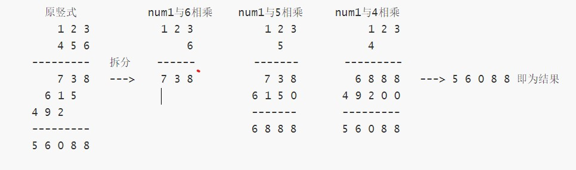
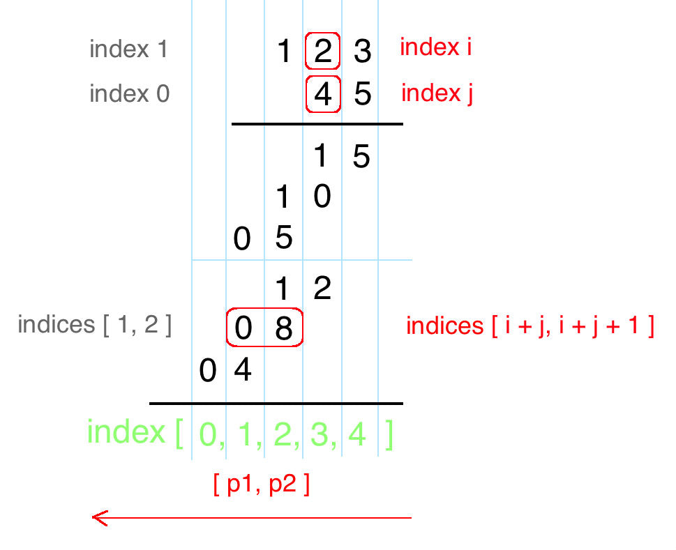

参考[leetcode题解](https://leetcode.cn/problems/multiply-strings/solutions/29100/you-hua-ban-shu-shi-da-bai-994-by-breezean/)

竖式运算思想，以 num1 为 123，num2 为 456 为例分析：

方法二：优化竖式
该算法是通过两数相乘时，乘数某位与被乘数某位相乘，与产生结果的位置的规律来完成。具体规律如下：

乘数 num1 位数为 M，被乘数 num2 位数为 N， num1 x num2 结果 res 最大总位数为 M+N
num1[i] x num2[j] 的结果为 tmp(位数为两位，"0x", "xy" 的形式)，其第一位位于 res[i+j]，第二位位于 res[i+j+1]。


```python
class Solution:
    def multiply(self, num1: str, num2: str) -> str:
        m, n = len(num1), len(num2)
        res = [0] * (m + n) # 结果最多为 m + n 位数
        for i in range(m - 1, -1, -1):
            n1 = ord(num1[i]) - ord('0')
            for j in range(n - 1, -1, -1):
                n2 = ord(num2[j]) - ord('0')
                p = res[i + j + 1] + n1 * n2   # 注意这里res[i + j + 1]容易漏
                p1, p2 = divmod(p, 10)
                res[i + j] += p1
                res[i + j + 1] = p2
        i = 0
        # 注意这里m + n - 1，这样不用return s if len(s) else "0"
        # 保留了最后一位数字，结果为0的时候能正常输出"0"
        while i < m + n - 1 and res[i] == 0:
            i += 1
        s = ""
        for j in range(i, m + n):
            s += str(res[j])
        # return s if len(s) else "0"
        return s
```