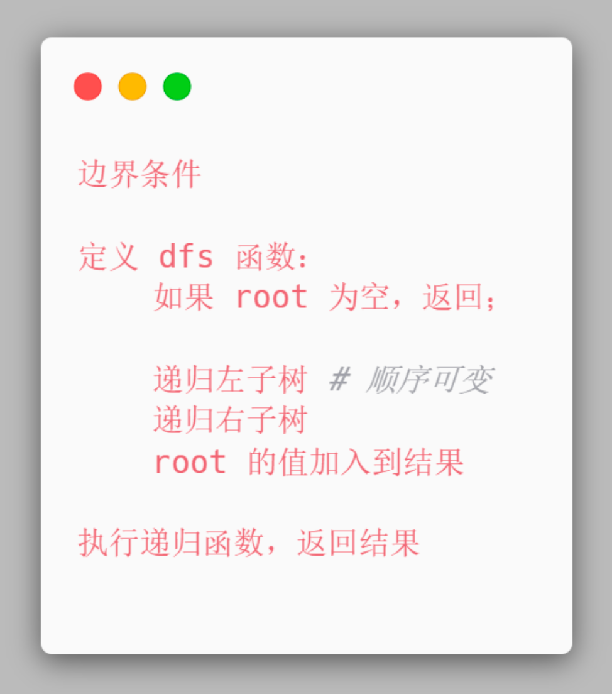

作者：腐烂的橘子
链接：https://leetcode.cn/problems/binary-tree-preorder-traversal/solutions/

LeetCode 题目中，二叉树的遍历方式是最基本，也是最重要的一类题目，我们将从「前序」、「中序」、「后序」、「层序」四种遍历方式出发，总结他们的递归和迭代解法。

1. 相关题目
这里是 4 道相关题目：

144.二叉树的前序遍历
94. 二叉树的中序遍历
145. 二叉树的后序遍历
102. 二叉树的层序遍历
2. 基本概念
要解决这四道题目，最基本的前提是要了解 什么是二叉树，以及二叉树的遍历方式。如果你已经有所了解，则可以直接查看下一节的内容。

二叉树

首先，二叉树是一种「数据结构」，详细的介绍可以通过 「探索」卡片 来进行学习。简单来说，就是一个包含 节点，以及它的 左右孩子 的一种数据结构。

遍历方式

如果对每一个节点进行编号，你会用什么方式去遍历每个节点呢？

前序：根左右
中序：左根右
后序：左右根
（根在哪个位置，就什么序）
如果你按照 `根节点 -> 左孩子 -> 右孩子` 的方式遍历，即「前序遍历」，每次先遍历根节点，遍历结果为 1 2 4 5 3 6 7；

同理，如果你按照 `左孩子 -> 根节点 -> 右孩子` 的方式遍历，即「中序序遍历」，遍历结果为 4 2 5 1 6 3 7；

如果你按照 `左孩子 -> 右孩子 -> 根节点` 的方式遍历，即「后序序遍历」，遍历结果为 4 5 2 6 7 3 1；

最后，层次遍历就是按照每一层从左向右的方式进行遍历，遍历结果为 1 2 3 4 5 6 7。

3. 题目解析
这四道题目描述是相似的，就是给定一个二叉树，让我们使用一个数组来返回遍历结果，首先来看递归解法。

3.1 递归解法
由于层次遍历的递归解法不是主流，因此只介绍前三种的递归解法。它们的模板相对比较固定，一般都会新增一个 dfs 函数：

对于前序、中序和后序遍历，只需将递归函数里的 res.append(root.val) 放在 不同位置 即可，然后调用这个递归函数就可以了，代码完全一样。

1. 前序遍历

2. 中序遍历

3. 后序遍历

一样的代码，稍微调用一下位置就可以，如此固定的套路，使得只掌握递归解法并不足以令面试官信服。
因此我们有必要再掌握迭代解法，同时也会加深我们对数据结构的理解。

3.2 迭代解法
a. 二叉树的前序遍历

LeetCode 题目： 144.二叉树的前序遍历

常规解法

我们使用栈来进行迭代，过程如下：

初始化栈，并将根节点入栈；
当栈不为空时：
弹出栈顶元素 node，并将值添加到结果中；
如果 node 的右子树非空，将右子树入栈；
如果 node 的左子树非空，将左子树入栈；
由于栈是“先进后出”的顺序，所以入栈时先将右子树入栈，这样使得前序遍历结果为 “根->左->右”的顺序。

4. 总结
总结一下，在二叉树的前序、中序、后序遍历中，递归实现的伪代码为：

迭代实现的伪代码为：
